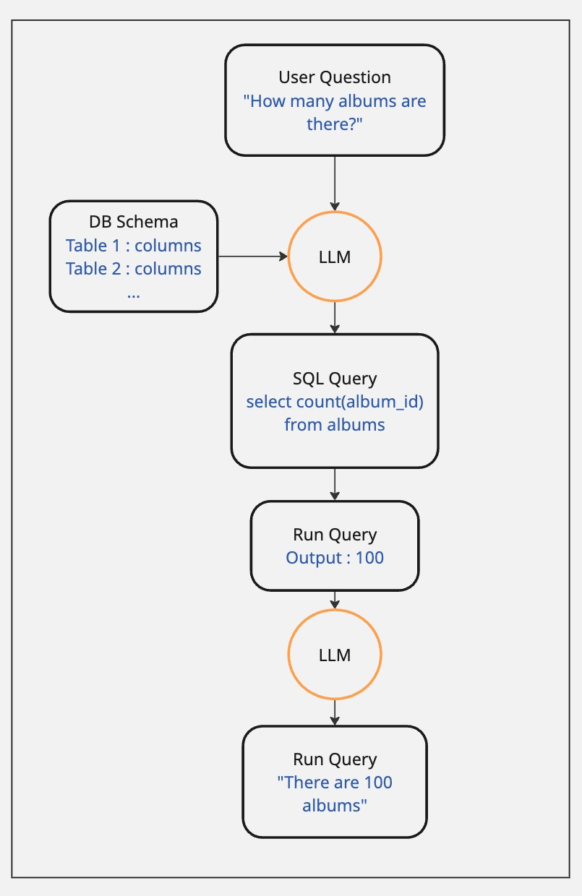

# Chat with My DB

This is a Streamlit-based application that lets you **chat with your database** using natural language. Powered by **Google Gemini 1.5 Flash** and **LangChain**, it converts your questions into SQL, queries your database, and gives easy-to-understand answers.

---

## Features

- Connect to a local SQLite database
- Ask natural-language questions about your data
- Automatically generates and executes SQL queries using Gemini AI
- View your database’s tables and columns in the sidebar
- Chat history retained across queries for contextual conversations
- Built using LangChain, Streamlit, and Gemini 1.5 Flash

---

## Getting Started
1. Clone the Repository
`git clone https://github.com/nitinnandansingh/MyDBAssistant.git`
`cd chat-with-db`

2. Set Up Environment
`pip install -r requirements.txt`

3. Add Your .env File
`GEMINI_API_KEY=your_google_gemini_api_key_here`

## Running the App
`streamlit run app.py`

* The database used in this app is sourced from [chinook](https://github.com/lerocha/chinook-database/tree/master/ChinookDatabase/DataSources)
